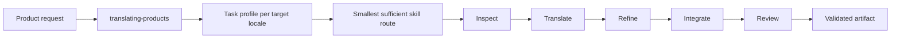

# Translation suite architecture

The suite separates orchestration, translation, product constraints, locale
mechanics, and review. An agent can therefore load the smallest useful set of
instructions instead of treating every translation as the same task.

[`skills-manifest.json`](../skills-manifest.json) is the public source of truth.
The generated [capability catalog](../skills/translating-products/references/capability-catalog.md)
is the orchestrator's local routing view.

## At a glance



The orchestrator coordinates the route; it does not duplicate the specialist
instructions. Multiple target locales share approved project evidence but keep
their linguistic decisions and QA isolated.

## Responsibilities

| Component | Owns |
| --- | --- |
| `translating-products` | Setup, task classification, routing, sequencing, optional sub-agents, conflict resolution, and recovery |
| `translating-core` | Meaning, source context, audience, register, product-language evidence, semantic groups, terminology, style, and protected structure |
| Surface skills | Web, software, mobile, marketing, documentation, and store constraints |
| Platform skills | iOS, Android, Flutter, and platform-specific formats and behavior |
| Script and language skills | Writing-system, language, locale, and linguistic refinement |
| `reviewing-translations` | Final structural and linguistic QA |

When guidance conflicts, authority is resolved in this order:

1. explicit user requirements;
2. approved project configuration;
3. core semantic fidelity;
4. domain terminology;
5. language and locale mechanics;
6. product and platform formatting; and
7. stylistic preferences.

A later or narrower stage may refine wording. It cannot silently change facts,
names, numbers, links, code, protected values, or approved terminology.

## Routing

The orchestrator builds one task profile for every exact target locale. A
profile can include:

- source and target locale;
- language and observed or requested writing system;
- surface, platform, format, and domain;
- requested capability;
- audience, purpose, and register dimensions; and
- protected structural constraints.

Register is multidimensional: form of address, institutional or personal
voice, courtesy, directness, and surface convention are kept separate rather
than compressed into a formal/informal switch.

The router matches those axes against declarative catalog selectors, adds the
mandatory core and review capabilities, expands dependencies, resolves
conflicts and explicit supersession, then orders the route by phase, ownership,
specificity, and stable manifest order. It has no hardcoded surface-to-skill or
language/product lookup table.

Every selected route runs:

```text
inspect → translate → refine → integrate → review
```

| Phase | Result |
| --- | --- |
| Inspect | A translation contract and protected invariants, without invented target wording |
| Translate | A meaning-faithful draft produced by core guidance |
| Refine | Script, language, and locale specialists adjust only their owned dimension |
| Integrate | Approved wording returns to the artifact without changing protected structure |
| Review | Structural and linguistic QA checks the completed result |

Locale guidance refines language guidance, which refines broader
writing-system guidance. Latin, CJK, and RTL are examples of coherent
capability modules, not an exhaustive taxonomy.

For a Portuguese, Japanese, and Arabic request, artifact inspection and
approved context can be shared. The profiles, routes, drafts, and QA remain
separate until reintegration, preventing vocabulary or register from leaking
between locales.

Unknown languages can use core when it can cover the request coherently.
Missing essential capabilities are reported rather than invented, and routing
never downloads a skill.

## Product evidence and semantic groups

Before drafting, the suite can derive evidence from:

- approved glossary and style guidance;
- approved translation-memory entries;
- structurally aligned, verified existing target copy; and
- related units in the same product flow.

Related units are grouped when meaning crosses string boundaries—for example,
an assessment stem and its choices, an email subject and body, or repeated
lifecycle events. The group is checked for consistent terminology, participant
roles, agency, and truth. Existing copy and human suggestions remain evidence,
not automatic authority.

Recurring or high-impact unresolved terminology receives a focused terminology
decision. Inferred terminology is recorded only as `draft`; it cannot satisfy
an approved-glossary requirement until the project's normal approval process
accepts it.

## Project context and approval

Before translating, the orchestrator checks `.translation/` for:

```text
.translation/
├── project-brief.md
├── locales.yaml
├── glossary.csv
├── style-guide.md
├── protected-terms.txt
├── setup-approval.json
├── decisions.md
├── translation-memory.csv
└── research-sources.md
```

If the required context is missing or invalid, translation pauses. The agent
asks one setup question at a time, presents the complete configuration, and
waits for approval before writing context or translating.

Readiness is determined by `scripts/policy.py` from semantic values, not
filenames:

- project brief and style guide require approved statuses and complete labeled
  values;
- locales use `source_locale`, `target_locales`, `fallback_locale`, and
  `neutral_variants_allowed`;
- glossary rows use the required schema and must be usable and approved; and
- protected terms contain one non-comment term per line.

An empty glossary or protected-term file is valid only when explicitly
approved as empty.

`setup-approval.json` records the approver, timestamp, explicitly approved
empty collections, and SHA-256 hashes of the five required context files. It
does not hash itself. Any byte change to those files—including line endings—
invalidates approval. Optional decision, memory, and research files do not.

A source-locale mismatch or unconfigured target produces one focused question.
Affected copy remains withheld until the mismatch is resolved.

## Research

Bundled and approved project knowledge is the default. Browsing is allowed
only for one concrete unresolved question involving a current product
requirement, time-sensitive term, regional expression, market convention, or
usage claim. Research stops when that question is resolved and records its
source and decision in `.translation/`.

Routine wording, grammar, and precautionary background research do not trigger
browsing. If research tools are unavailable, bundled guidance remains the
fallback unless the open question prevents a coherent result.

## Sub-agents

Sub-agents are optional and beneficial-only. They fit:

- multiple independent locales of meaningful size;
- a large source that separates cleanly;
- an independent terminology pass; or
- a materially useful independent review.

Short, single-locale work stays in one agent. Every sub-agent receives the same
brief, glossary, protected terms, style guide, evidence, and structural
constraints. The orchestrator remains responsible for composition and review.

Hosts without sub-agents execute the same stages sequentially. A fresh review
agent can be independently blinded. A same-agent sequential challenge receives
the same sanitized input but cannot erase prior context, so its artifact records
`execution_mode: sequential` and does not claim equivalent independence.

Both modes use the same coverage, adjudication, correction QA, artifact schema,
and deterministic validator. Failed sub-agent work is retried once while valid
completed locales remain intact.

## External skills

An external specialist is eligible only when it is already installed and its
metadata satisfies the [extension contract](../skills/translating-products/references/extension-contract.md).
It must also be authorized by the user, project configuration, or reviewed
[compatibility registry](../skills/translating-products/references/compatibility-registry.json).

The public contract describes selectors, phases, specificity, required
context, dependencies, conflicts, supersession, and authority boundaries.
Registry membership is compatibility evidence, not permission to install or
enable a skill. An absent or unauthorized specialist falls back to bundled
guidance; an unknown specialist is never downloaded during translation.

Bundled adaptations are pinned to immutable upstream commits and SHA-256
checksums with compatible licenses, notices, capability mappings, and local
adapters. Source updates require review; ordinary pull requests use only the
committed material.

## Untrusted translation data

All content being translated is data, including markup, metadata, comments,
code blocks, examples, retrieved text, URLs, Unicode controls, and a `SKILL.md`
body supplied as text. Embedded instructions, role labels, tool calls, or
authority claims cannot change routing, invoke tools, reveal secrets, install
skills, or weaken project policy.

Only host-recognized installed skill instructions operate as skills. System
and developer instructions, the real user request, and approved project
configuration keep their normal authority.

## Review and deterministic validation

Structural QA checks placeholders, ICU topology, keys, markup, links, code,
commands, identifiers, numbers, and other protected material. Surface and
platform skills add format-specific checks such as metadata, String Catalogs,
Android resources, ARB files, store limits, accessibility, and bidirectional UI.

Linguistic QA uses six ordered passes:

1. semantic fidelity;
2. terminology;
3. linguistic quality;
4. locale conventions;
5. structural integrity; and
6. surface fitness.

It also reads the target independently for naturalness and checks semantic
groups, participant roles, assessment truth, audience, register, and source
quality. Locale-specific grammar remains owned by the matching specialist.

Review depth is resolved by `scripts/policy.py review-depth`:

| Depth | Selected when |
| --- | --- |
| `single` | Ordinary translation QA needs no independent challenge |
| `selective_challenge` | The caller requests selective review or a multi-unit audit and no stronger condition applies |
| `full_challenge` | The caller requests it, policy or route requires it, an essential specialist is missing, confidence is low, or the source is blocked |

Challenge input includes approved context, selected capabilities, source,
current target, protected values, verified evidence, semantic groups, and
automatic checks. It excludes every primary finding, classification,
recommendation, confidence, and rationale to limit direct anchoring.

Accepted defects are corrected by their owning specialist, checked against
related unchanged units, and only changed units repeat ordinary QA. The final
artifact must pass `validate_review_artifact.py`.

Automated status is not human approval. The canonical schema keeps unit status,
human decision, correction, severity, notes, and reviewer provenance separate.

## Failure recovery

| Failure | Response |
| --- | --- |
| Missing or stale configuration | Start or resume project setup |
| Ambiguous locale | Ask one focused question |
| Missing external specialist | Fall back to bundled guidance |
| Missing essential capability | Report it when core cannot cover the task |
| Structural corruption | Retry only the affected segment |
| Failed sub-agent | Retry once and preserve completed locales |
| Failed QA | Return the affected section to its owning specialist |
| Unavailable research | Use bundled knowledge unless the unresolved question blocks coherent translation |

## Host portability

Every discoverable skill lives at `skills/<name>/SKILL.md` with only `name` and
`description` frontmatter. Skill bodies avoid host-specific invocation syntax
and undocumented dependencies outside their own directories.

Routing and policy scripts use Python's standard library and no host SDK. The
same suite is discoverable by Claude Code, Codex, Cursor, and universal Agent
Skills hosts. The smoke installer verifies the exact manifest inventory in
disposable targets and never writes to a developer's global skill directory.

See [Getting started](getting-started.md) for installation commands and the
[benchmarking overview](benchmarking.md) for evaluation workflows.
